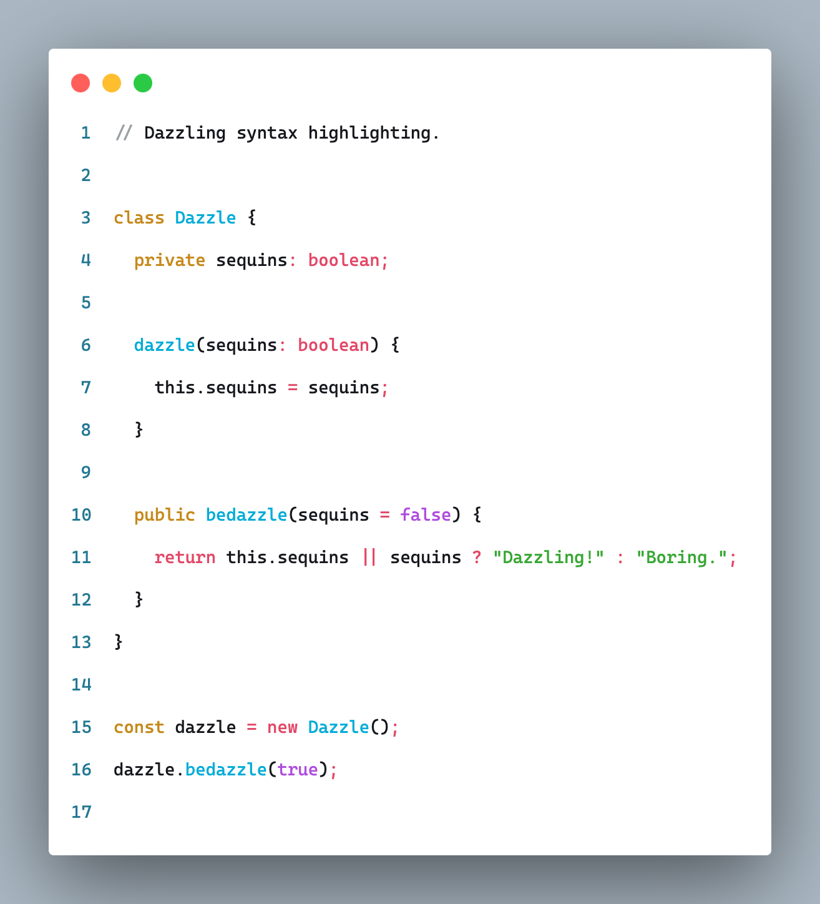
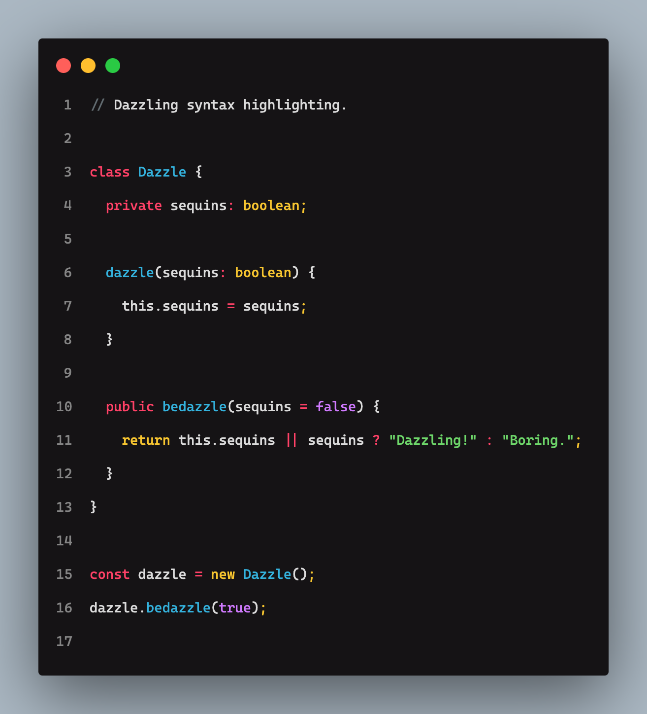

# Dazzle

Dazzle is a simple &amp; opinionated color theme. It includes an official [Visual Studio Code](https://code.visualstudio.com/) extension.

## Appreciation

Please ⭐︎ (star) our GitHub repository if you like the theme. This is very helpful for us to gauge interest.

## Palette

### Light

### Dark

## Compatability

Testing a color theme for all widely used programming languages, data structure formats and text formatting is a non-trivial effort, for this reason, we ask for your patience and understanding as we build out support. We may also choose not to pursue support for certain syntaxes.

### Support

Currently Dazzle has been tested with following syntaxes.

- JavaScript
- TypeScript
- PHP

## Changelog

All notable changes to this project will be documented in the [CHANGELOG.md](./CHANGELOG.md) file.

## Contribution

We welcome contributions from the community! Please read our [CONTRIBUTING.md](./CONTRIBUTING.md) file for guidelines on how to get started.

## License

The original code in this repository is licensed under the MIT License © 2025 Modoterra Corporation. See the LICENSE.md file for details.
